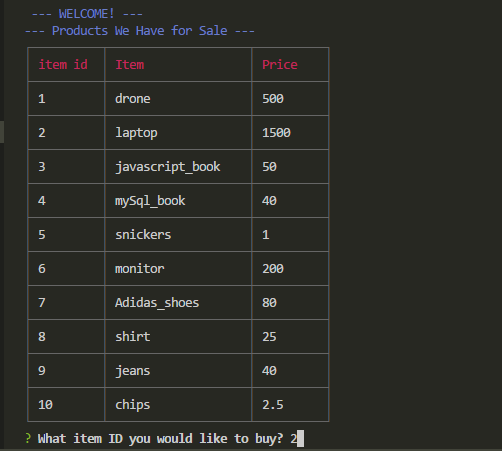
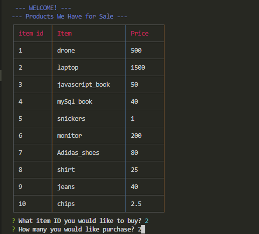
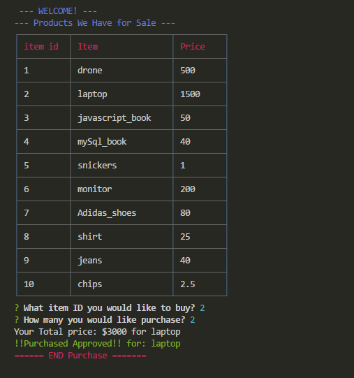
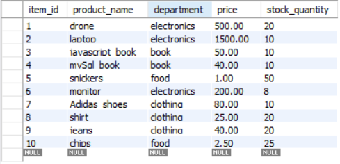
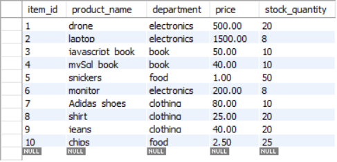

# Bamazon using Node. JS & MySQL
It is an Amazon-like storefront app with functionality for customers to buy products. (still in progress: managers application to update inventory in databases, and supervisors application to view cost and profits.)

## Technologies
- Visual Studio Code
- Javascript
- Node.js
- MySQL Workbench

## Node Package Manager
- mysql
- inquirer
- cli-table
- colors

## Instructions 

1. Clone repo to your local machine
2. Install required NPM
3. Open up MySQL Workbench to create the database and tables using the schema file
4. Once above are done, enter node <file_name.js>

### For Example: Customer App
A table of items will be displayed and a prompt will ask "What Item ID you would like to buy?": 
5. Enter ID (one ID only)
Screenshot example: I chose ID 2
 

Then choose how many of the product you want to purchase. Depending on the amount you enter, 
    - If we there is no stock left, it will say "Insufficient..." and the process will start over again.
    - If we there is enough in stock, it will continue on and will generate your total price.
6. Enter amount
Screenshot: I chose amount 2
 

Once everything goes through with total price, the database will update the stock inventory.
Screenshot: Final Sale once everthing goes through
 

## Database Screenshots
- Before Purchase of ITEM ID 2

- After Purchase of ITEM ID 2

### Still in development stage:
* Manager App
* Supervisor App